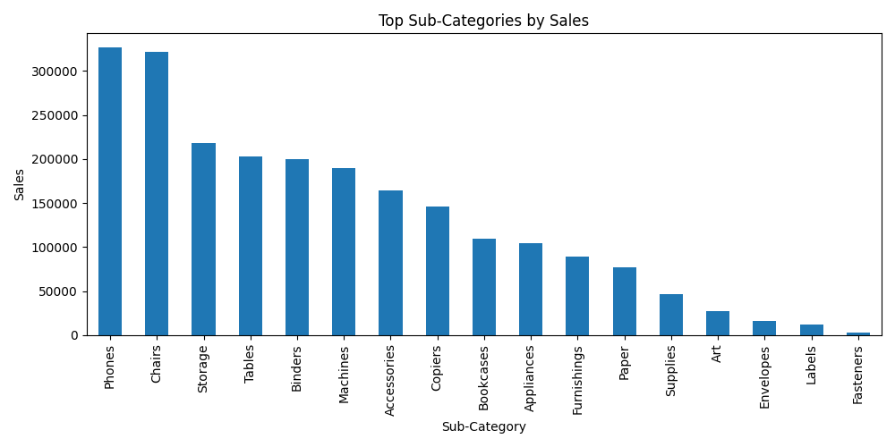

# 📊 Sales Data Analysis Project

## 📌 Overview
This project analyzes retail sales data using Python.

## 🛠 Tools Used
- Python
- Pandas
- Matplotlib

## 📂 Project Structure
- data/ → dataset (sales.csv)
- src/ → analysis code (analysis.py)
- images/ → generated charts

## 📈 Features
- Data cleaning
- Sales analysis by category
- Visualization using bar charts

## 📊 Sample Output


## 🚀 How to Run
```bash
pip install pandas matplotlib
python src/analysis.py
```

## 👨‍💻 Author
Ali Hassan
